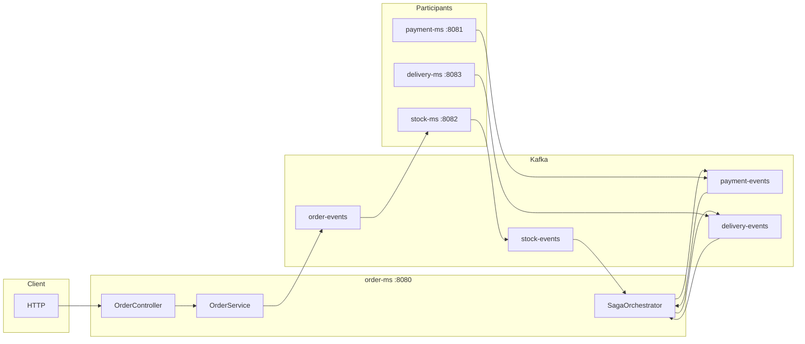
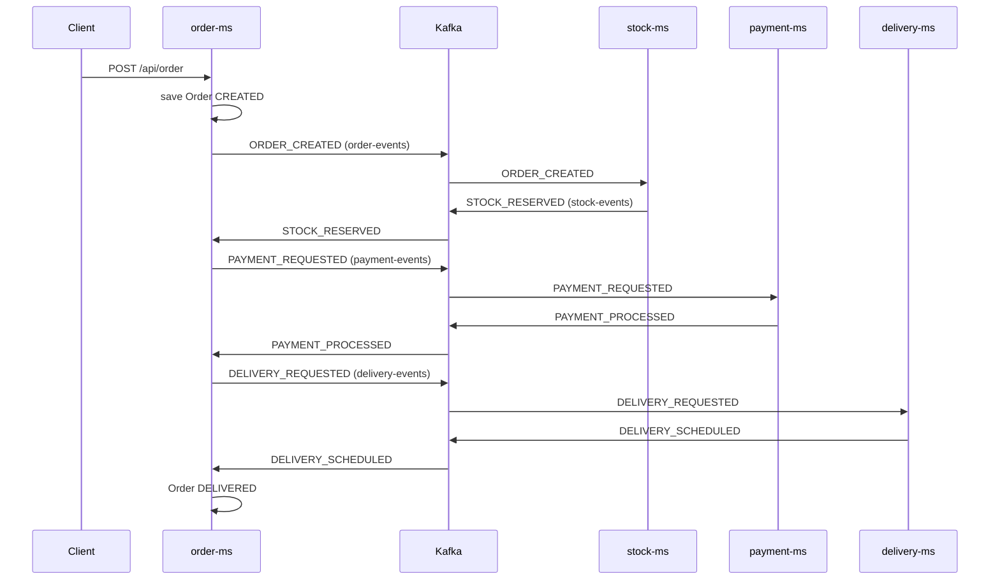
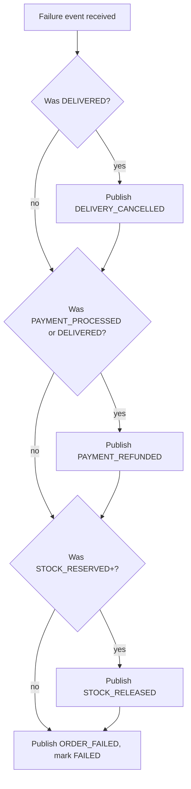

# Saga order pipeline (Spring Boot + Kafka)

This repository is a **multi-service demo** of a **distributed saga** for a simple e-commerce order: reserve stock, take payment, schedule delivery. Services communicate through **Apache Kafka** topics using a shared **`SagaEvent`** JSON envelope (`saga-common`). **order-ms** is the **orchestrator**: it reacts to participant outcomes and publishes the next command or **compensating** events when something fails.

## Concepts

| Idea | Role here |
|------|-----------|
| **Saga** | Long-running business process split across services; each step has a **local transaction** and a matching **compensation** if later steps fail. |
| **Orchestration** | A single component (**SagaOrchestrator**) decides what to do next from events; participants stay dumb about the global flow. |
| **Choreography vs orchestration** | This project uses **orchestration** for the main path and failure path (order service drives `PAYMENT_REQUESTED`, `DELIVERY_REQUESTED`, and compensation publishes). |
| **2PC** | Classic two-phase commit is **not** implemented here; sagas trade **eventual consistency** and explicit undo steps for **availability** without a global lock. |

## Architecture



## Modules

| Module | Purpose |
|--------|---------|
| `saga-common` | Shared `SagaEvent`, `SagaEventType`, `SagaTopics`, topic factory helpers. |
| `order-ms` | REST API, `Order` persistence, publishes `ORDER_CREATED`, runs **SagaOrchestrator**. |
| `stock-ms` | Listens `order-events` (`ORDER_CREATED`), publishes `STOCK_RESERVED` / failure; listens `STOCK_RELEASED` for compensation. |
| `payment-ms` | Listens `payment-events` (`PAYMENT_REQUESTED`, `PAYMENT_REFUNDED`). |
| `delivery-ms` | Listens `delivery-events` (`DELIVERY_REQUESTED`, `DELIVERY_CANCELLED`). |

## Happy path (forward flow)



## Compensation (failure path)

When a participant publishes a **failure** event (`STOCK_RESERVE_FAILED`, `PAYMENT_FAILED`, `DELIVERY_FAILED`) or `EventStatus.FAILED`, the orchestrator runs **reverse** steps only for work that actually completed: cancel delivery (if delivered), refund payment (if paid), release stock (if reserved), then publishes `ORDER_FAILED` on `order-events` and sets the order to **FAILED**. `CompensationStatus` on the order records how far publishing progressed.



## Failure simulation

Optional JSON field **`failAt`** on create order: `"STOCK"`, `"PAYMENT"`, or `"DELIVERY"` (case-insensitive). It is stored on the order and copied into every saga **payload** so the matching service can **simulate** a failure without changing inventory or payment rules.

## REST API

- `POST /api/order` — body: `productId`, `quantity`, `amount`, optional `failAt`. Starts the saga.
- `GET /api/order/{id}` — returns the **Order** entity or **404**.

## Ports

| Service | Port |
|---------|------|
| order-ms | 8080 |
| payment-ms | 8081 |
| stock-ms | 8082 |
| delivery-ms | 8083 |
| Kafka (host) | 9092 |

## Run locally

1. Start Kafka (and ZooKeeper) from the repo root:

   ```bash
   docker compose up -d
   ```

2. Install shared library and run all services (separate terminals or your IDE):

   ```bash
   mvn clean install -pl saga-common -am
   mvn spring-boot:run -pl order-ms
   mvn spring-boot:run -pl stock-ms
   mvn spring-boot:run -pl payment-ms
   mvn spring-boot:run -pl delivery-ms
   ```

   Each module expects `spring.kafka.bootstrap-servers=localhost:9092` (already in `application.properties`).

3. Run tests (Kafka need not be up for default tests; listeners are disabled in test `application.properties` where configured):

   ```bash
   mvn test
   ```

## Aggregator build

The root `pom.xml` lists `saga-common` and all microservices so you can build the whole tree with `mvn clean install` from the repository root.
