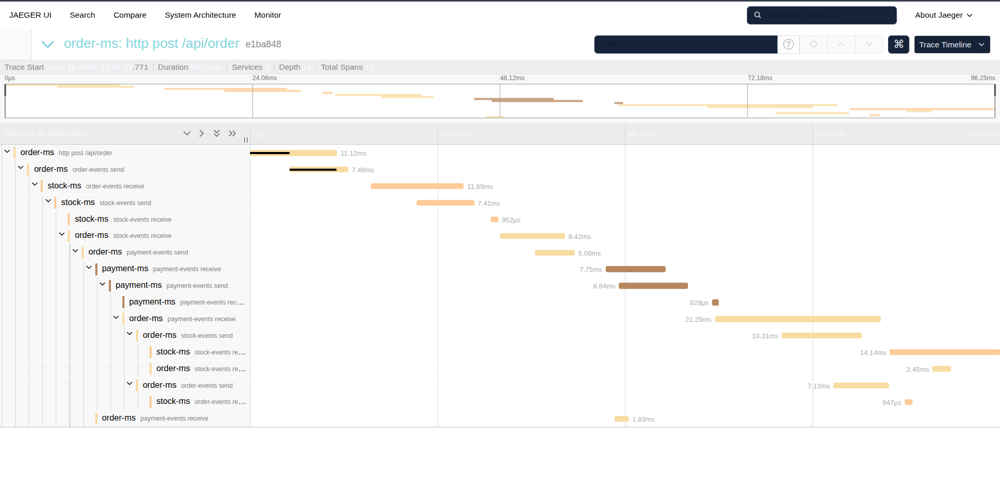
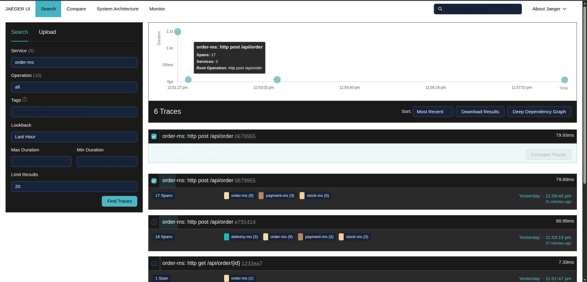

# Distributed Transactions Laboratory: Saga vs. 2PC

This project is a high-fidelity demonstration of Distributed Transaction Patterns using Spring Boot, Apache Kafka, and OpenTelemetry. It provides a practical laboratory to explore and compare Event-Driven Sagas (Eventual Consistency) and Two-Phase Commit (Strong Consistency).

## Key Architectural Patterns

### 1. Choreographed Saga (Orchestrated)
- **Mechanism:** Asynchronous communication via Kafka.
- **Resilience:** Implements automatic compensation (rollbacks) when a step in the chain fails (e.g., Payment failure triggers Stock release).
- **Observability:** Stitched together with OpenTelemetry and Jaeger for full distributed trace visualization.

### 2. Transactional Outbox Pattern
- **Problem Solved:** The "Dual-Write" problem.
- **Implementation:** Business logic and event logging happen in a single atomic DB transaction. A background relay ensures the event is eventually published to Kafka, even if the service crashes after the DB commit.

### 3. Idempotent Consumer (Inbox Pattern)
- **Problem Solved:** Duplicate message processing (at-least-once delivery side effects).
- **Implementation:** Every service tracks eventIds in an inbox_events table. Duplicate messages are detected and discarded within the business transaction.

### 4. Two-Phase Commit (2PC) Lab
- **Mechanism:** Synchronous Prepare-Commit flow via REST.
- **Trade-off:** Demonstrates strong consistency and immediate feedback at the cost of higher latency and resource locking.

---

## Technology Stack
- Java 17 & Spring Boot 3.1.5
- Apache Kafka (Message Broker)
- OpenTelemetry & Jaeger (Distributed Tracing)
- H2 Database (In-memory persistence for demo simplicity)
- Docker & Docker Compose (Containerization)

---

## Getting Started

### 1. Build the Project
```bash
mvn clean install -DskipTests
```

### 2. Launch Infrastructure & Services
```bash
docker-compose up -d --build
```

### 3. Open Observability Dashboard
- **Jaeger UI:** [http://localhost:16686](http://localhost:16686)

---

## Interactive Demos

### Demo 1: The Asynchronous Saga (Success)
Trigger a full order flow: Stock -> Payment -> Delivery.
```bash
curl -X POST http://localhost:8888/api/order \
     -H "Content-Type: application/json" \
     -d '{"productId": 1, "quantity": 1, "amount": 100.0}'
```
#### Visualization (Happy Path)

*Full sequence visualization in Jaeger across all 4 services.*

### Demo 2: Automatic Compensation (Failure)
Simulate a failure at the Payment step.
```bash
curl -X POST http://localhost:8888/api/order \
     -H "Content-Type: application/json" \
     -d '{"productId": 1, "quantity": 1, "amount": 100.0, "failAt": "PAYMENT"}'
```
#### Visualization (Compensation)

*Observation of the automatic rollback (STOCK_RELEASED) after Payment failure.*

### Demo 3: The 2PC Alternative (Synchronous)
Demonstrate strong consistency via a 2-Phase Commit flow.
```bash
curl -X POST http://localhost:8888/api/2pc/order \
     -H "Content-Type: application/json" \
     -d '{"productId": 1, "quantity": 1, "amount": 10.0}'
```

---

## Robustness Validation
To verify the Transactional Outbox and Idempotency logic, access any service's H2 console:
- **Order-MS Console:** [http://localhost:8888/h2-console] (JDBC URL: jdbc:h2:mem:ordersdb, User: sa)

Run:
```sql
SELECT * FROM OUTBOX_EVENTS;  -- Verification of the Outbox Relay
SELECT * FROM INBOX_EVENTS;   -- Verification of Idempotency tracking
```

---

## Comparison: Saga vs. 2PC

| Feature | Saga Pattern | Two-Phase Commit (2PC) |
| :--- | :--- | :--- |
| **Consistency** | Eventual | Strong |
| **Availability** | High (Asynchronous) | Lower (Synchronous) |
| **Scalability** | High (Kafka-based) | Low (Central Coordinator) |
| **Isolation** | None (ACID "I" missing) | Guaranteed (Locks resources) |

---

## License
This project is licensed under the MIT License - see the [LICENSE](LICENSE) file for details.
